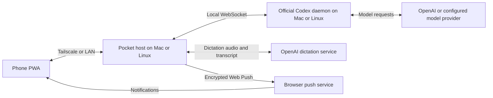

# codex-pocket

Keep working with Codex after you step away from your computer.

A phone-sized PWA that connects to Codex on your Mac or Linux server over Tailscale or the LAN. Scan a QR code to pair, then continue a conversation or start a new task from your phone.

[中文说明](./README.zh-CN.md)

[Download](https://github.com/pocket-works/codex-pocket/releases/latest) · [Quick start](#quick-start) · [Tailscale setup](#deploying-https-via-tailscale) · [Troubleshooting](#faq-and-troubleshooting) · [Contributing](./CONTRIBUTING.md)

## Why Codex Pocket

- **Your phone connects to your computer; your computer connects to OpenAI.** If ChatGPT on your phone requires a proxy or is slow to reach, use Pocket through Tailscale or the LAN. Your phone only needs to reach the computer; the computer handles model access using its existing network setup.
- **Use the development environment you already have.** Tasks run on your computer with its repositories, files, command-line tools, Codex configuration and skills. Pocket reuses the computer's Codex login, so there is no separate Codex sign-in on the phone.
- **Pick up the same desktop conversation on macOS.** Enable desktop sharing to continue the ChatGPT desktop app's Codex threads on your phone, with shared history and the same running task. Return to the desktop and keep going there.
- **Do development work from your phone.** Start a task in a project or a new worktree, choose a branch, inspect diffs and subagent progress, steer a running task, or request a code review. Send images and CSV files, mention files, invoke skills, or dictate your instructions.
- **Keep several computers in your pocket.** Switch computers in one installed PWA, with separate drafts and credentials. Switching keeps tasks running; completion, approval and question notifications help you know when to return.
- **Use it in your browser and make it your own.** Open the phone interface in a browser or add it to the Home Screen. The project is MIT licensed, so you can inspect and customize it.

Your phone does not need a separate proxy for ChatGPT. The computer still needs access to the model service; responsiveness depends on both network connections and the model service.

## Who it is for

Pocket is useful when Codex already works well on your computer and you want to keep working from your phone: continue a coding task while away from your desk, check a long run, review its output, or manage several computers. It is especially useful when reaching ChatGPT directly from your phone is inconvenient but your computer's OpenAI connection is already configured.

Pocket is a community project built on the official Codex app-server. You provide the computer and its network connection; the computer must stay awake and online for tasks on it. Pocket itself is MIT licensed, and model access and usage remain governed by your existing Codex account and provider configuration.

## Features

- **Projects and conversations:** on macOS with desktop sharing, projects stay in sync with the desktop; replies stream with collapsible reasoning and tool calls. Rename, swipe to archive, or fork a conversation.
- **Task control:** approve commands, switch approval policies, interrupt a task, steer it with follow-up instructions, or queue messages shared with the desktop. Choose the model, reasoning effort and Fast tier.
- **Development workflow:** start project or project-less chats, work locally or in a new worktree, choose a branch, inspect diffs, and request code reviews. View subagent status and read-only child conversations.
- **Input and context:** attach images and CSV files, mention files with `@file`, invoke `/skills`, and dictate instructions through the computer. Answer Codex's questions and view plans and usage.
- **Output previews:** view images created on the computer and local multi-page PDFs from the conversation.
- **Desktop continuity (macOS):** enable desktop sharing to use the same Codex threads and running tasks from the phone and ChatGPT desktop app.
- **Notifications:** Web Push for completed turns, approvals, questions and errors. On iOS, install the PWA on the Home Screen first.
- **Multiple computers:** one installed PWA, with separate credentials, drafts, pins and notification subscriptions for each computer.

## Screenshots

| Threads | Conversation | Approval |
| :---: | :---: | :---: |
|  |  |  |

| Subagent entry | Subagent list |
| :---: | :---: |
|  |  |

| Image preview | Computer settings |
| :---: | :---: |
|  |  |

| Computer selection | New thread |
| :---: | :---: |
|  |  |

These screens use fictional conversations, paths and computer details; no personal thread content or pairing credentials are shown.

## Requirements

- **An Apple silicon Mac, or a Linux x86_64 server.** The DMG targets macOS arm64. Linux uses the separate experimental host archive; see [Linux deployment](./docs/linux.md).
- **Codex already signed in on that Mac.** For the DMG, install and sign in to the ChatGPT desktop app first; Pocket can use its bundled Codex CLI. A source build can also use an installed `codex` CLI. The host inherits Codex's login session rather than signing in itself.
- **Linux requires Node 22.12+ and an installed, signed-in Codex CLI** (tested with 0.161.0). No pnpm is needed for the Linux archive. Source builds need Node and pnpm. The Mac DMG includes its runtime.
- **A phone that can reach the computer**, over Tailscale or the LAN. On iOS, add the PWA to the Home Screen: web push does not arrive in a Safari tab.

### Compatibility and current limits

| Component | Current scope |
| :--- | :--- |
| Mac host | Published and local app builds target Apple silicon (arm64). Intel Macs and Windows hosts are outside the current app distribution. |
| Linux host (experimental) | Separate x86_64 archive. Debian 13 / Codex CLI 0.161.0 validated with a real iPhone PWA, including chat, push and dictation. ARM64, other distributions and systemd boot recovery are unverified. |
| iPhone / Safari | The documented phone setup uses Safari and a Home Screen PWA. Notifications require HTTPS and installation on the Home Screen. |
| Android / other browsers | The interface uses browser APIs, but the repository does not yet record real-device validation for these combinations. Treat them as unverified and include OS and browser versions when reporting results. |
| Desktop sharing (macOS) | Requires the daemon's `account/read` response to include `workspaceRouting` (Codex CLI 0.156.0 or newer). The link operation checks the actual capability. |
| Browser features | Basic chat uses WebSocket. Notifications and offline startup require HTTPS and service workers; dictation also requires microphone permission and browser audio APIs. |
| Automated checks | CI runs type checks, unit tests and host/PWA builds on Linux. It does not establish macOS or phone compatibility. |

The repository does not yet publish a complete macOS/iOS/browser version validation matrix. Dictation uses an undocumented ChatGPT endpoint, and simultaneous notifications from multiple Macs still need verification on an installed iPhone PWA.

## Quick start

### Deploy a Linux server

Download the Linux x86_64 archive from the [latest release](https://github.com/pocket-works/codex-pocket/releases/latest), then follow [Linux deployment](./docs/linux.md) for checksum verification, Node/Codex setup, Tailscale HTTPS, pairing and the optional systemd user service. This is a headless host; the menu bar app and desktop linking remain macOS features.

### Install the DMG

1. On an Apple silicon Mac, install and sign in to the ChatGPT desktop app.
2. Download the signed and notarized Apple silicon DMG from the [latest release](https://github.com/pocket-works/codex-pocket/releases/latest). Open it, drag **Codex Pocket** to **Applications**, then launch it from Applications. The app appears in the menu bar.
3. Choose the connection: for access away from home, follow [Tailscale HTTPS setup](#deploying-https-via-tailscale) before pairing; for basic chat on the LAN, connect the phone and Mac to the same network. HTTPS is needed for notifications and dictation. Choose **Pair a phone…** from the Pocket menu and scan the QR code, or open the displayed address and enter the code manually. The code expires after 10 minutes.
4. In Safari, open the PWA at the address you intend to keep (the HTTPS address if you want notifications), then choose **Add to Home Screen**. Open the installed PWA and pair again from the Pocket menu: iOS keeps its storage separate from Safari. For Web Push, open **Menu → Computers**, open your Mac's details using its information button, and enable **Notifications**.

To continue threads from the ChatGPT desktop app, follow [desktop sharing](#sharing-threads-with-the-desktop-app-recommended). Let active work finish before linking, then quit and reopen ChatGPT. Pocket also works without desktop sharing.


### Build from source

With Codex signed in, Node 22.12+ and pnpm installed on an Apple silicon Mac:

```bash
git clone https://github.com/pocket-works/codex-pocket.git
cd codex-pocket
pnpm install --frozen-lockfile
make app
make open-app
```

Pair the phone from the menu as above. `make app` produces an unsigned development build; use the release DMG for normal installation. See [compatibility and current limits](#compatibility-and-current-limits) for Codex and browser requirements.

## Multiple computers

1. Run an updated Codex Pocket on each computer and configure a separate [Tailscale HTTPS](#deploying-https-via-tailscale) address for each one.
2. Keep one installed phone PWA. Open **Menu → Computers**, choose **Add computer**, and scan the other computer's pairing QR inside that PWA. Manual pairing takes the other computer's HTTPS address and its code.
3. Select a computer from **Computers** to switch. Threads, projects, files and tasks belong to that computer. Switching saves drafts and does not stop running turns; an in-progress send or upload finishes before switching is available.
4. Open a computer's information button to edit its name and address, manage notifications, or view **Pairing details**. Use **Pair again** with a fresh code to recover access.
5. To remove a computer, use **Unpair computer** while that computer is reachable. This revokes phone access and keeps chats on the computer. **Remove locally** only forgets the phone's credentials; revoke the old pairing on the computer afterward.

The installed PWA keeps its original address. Once its resources have been cached, it can open and connect to another computer while the entry computer is unavailable. Initial installation, updates and registration of new notification workers require the entry address to be reachable. Each computer uses its own scoped Web Push subscription; notification clicks select that computer and thread. Concurrent notifications from multiple computers still require verification on an installed iPhone PWA.

An upgrade migrates the existing pairing and local data at this PWA's origin. Storage from separate browser origins or Home Screen apps cannot be imported automatically: add those computers again from the PWA you keep. An address change requires a fresh pairing; existing tokens are never sent to an edited address.

## Connection and data flow



- **Chat and files:** prompts and approvals go to Codex on your computer. Commands and file operations run there; Codex sends task context to its configured model provider. Phone uploads are stored in `~/.codex-pocket/uploads/` on the computer.
- **Login and local storage:** Codex credentials stay on the computer. The phone stores its own Pocket pairing tokens, drafts and preferences in browser storage; the host stores token hashes and push subscriptions. Chat history is managed by Codex.
- **Dictation:** microphone audio travels through the computer to OpenAI, with streamed transcripts returned to the phone. Pocket does not save the audio on the host.
- **Notifications:** the computer sends encrypted payloads through the browser's push service. The displayed notification can contain a conversation title or preview, a command approval snippet, or an error message. Push delivery needs internet access even when chat uses the LAN.

## Security model

The host is a **transparent proxy**: a paired phone gets everything the Codex app-server can do, including running commands and reading or writing files on the computer. The only two boundaries are network reachability and the pairing code, so:

- Reach it over Tailscale (or the LAN) only. With `bindHost 127.0.0.1` the port is not exposed on the LAN at all. **Do not** put it on the public internet (Cloudflare Tunnel, port forwarding, …) without an extra layer of authentication.
- Pairing codes are 8 characters, valid for 10 minutes, and voided after 5 wrong guesses. Device tokens are stored hashed and can be revoked at any time; the admin endpoints accept loopback plus an admin token only.
- Browser pairings are bound to the PWA origin. Cross-origin phone APIs require that pairing's token and origin; admin APIs have no cross-origin access. The phone retains a separate token for each computer.
- Dictation reuses the ChatGPT login in `~/.codex/auth.json` and sends audio to OpenAI through an undocumented endpoint. Pocket does not save the audio on the host. See [data flow](#connection-and-data-flow) and [troubleshooting](#faq-and-troubleshooting) for storage and connection details.

## Running it: the menu bar app

Opening **Codex Pocket** starts the phone host; quitting it stops phone access. Codex manages its own daemon. If desktop sharing is linked, its separate bridge keeps running until you choose **Unlink desktop…**.

- **Status:** grey means stopped, yellow means starting or waiting for Codex, green means ready, and red means an error. The menu shows the address and daemon connection status.
- **Pairing:** **Pair a phone…** shows the QR code and pairing code. Open a paired phone's submenu to revoke its access.
- **Keep this Mac awake:** prevents idle sleep while the host runs and remembers your choice. The display can still sleep; closing the lid on battery still puts the Mac to sleep.
- **Diagnostics:** use **Restart host** or **Open log** when troubleshooting.

## Deploying: HTTPS via Tailscale

Use Tailscale HTTPS for one address that works at home and away, with support for notifications and dictation. `tailscale serve` provides HTTPS in front of the Pocket host; Tailscale can connect directly on the same LAN.

1. Install Tailscale on the Mac and the phone with the same account, and enable **HTTPS Certificates** in the [admin console](https://login.tailscale.com/admin/dns) (the first `tailscale serve` prints the link).
2. On the Mac, proxy the tailnet name to the host:

   ```bash
   tailscale serve --bg --https=443 http://127.0.0.1:7333
   ```

   If you installed the DMG, add these fields to `~/.codex-pocket/config.json` (preserve any existing fields), replacing the sample tailnet name, then quit and reopen Pocket:

   ```json
   {
     "publicUrl": "https://<mac>.<tailnet>.ts.net",
     "bindHost": "127.0.0.1"
   }
   ```

   For a source build, use the equivalent CLI commands below, replacing the sample tailnet name. Restart the host afterward (`make restart` if you started it with `make start`):

   ```bash
   pnpm dev:host config set publicUrl "https://<mac>.<tailnet>.ts.net"
   pnpm dev:host config set bindHost 127.0.0.1   # loopback only: nothing else on the LAN can reach 7333
   ```

3. In the Pocket menu choose **Pair a phone…**; the QR points at `https://<mac>.<tailnet>.ts.net/#pair=…`. Scan it on the phone with Tailscale connected. Source-build users can also run `pnpm dev:host pair`. Tailscale issues and renews the certificate.
4. For the full-screen experience use "Add to Home Screen" in Safari. The installed PWA needs its own pairing: choose **Pair a phone…** again, then scan inside the PWA or type the 8-character code.
5. Open **Menu → Computers**, open your Mac's details, and turn on **Notifications**. The host pushes when a turn finishes, Codex asks for approval or input, or a turn fails — unless the app is open on that thread.

For source builds, `pnpm dev:host config` shows the current settings and `config unset <key>` restores a default. For DMG installations, edit `~/.codex-pocket/config.json` and restart Pocket to apply changes.

Without Tailscale, drop your own PEMs into `~/.codex-pocket/certs/fullchain.pem` and `certs/privkey.pem` and the host serves HTTPS itself (`--no-tls` forces plain HTTP). On a trusted LAN you can skip HTTPS altogether — leave `bindHost` unset and open `http://<LAN IP>:7333` — at the cost of features that need a secure context, such as push notifications and offline startup.

After opening the HTTPS PWA while the host is running and allowing its app resources to cache, it can open even when Pocket on the Mac is stopped or unreachable. It shows a connection notice and reconnects automatically when the host returns. After updating Pocket, open the phone app once while the host is running to refresh its offline cache. A first visit without cached resources still requires the host to be available.

Logs go to `~/.codex-pocket/host.log`; the Codex daemon logs to `~/.codex/app-server-control/app-server.log`.

Once the PWA is built, `serve` picks it up from `packages/web/dist`:

```bash
pnpm --filter @codex-pocket/web build
pnpm dev:host serve
```

## Sharing threads with the desktop app (recommended)

Desktop sharing lets the phone and ChatGPT desktop app continue the same Codex threads through one daemon. A desktop app using a separate app-server may hold a thread that the phone cannot open for writing.

1. Let active turns finish, then choose **Desktop sharing → Link desktop…** in the Pocket menu.
2. The operation checks daemon compatibility. If the daemon lacks the desktop tools environment, linking restarts it once and interrupts active turns.
3. Quit and reopen ChatGPT, then open the desktop thread on your phone.

To return ChatGPT to its own app-server, choose **Desktop sharing → Unlink desktop…**, then quit and reopen ChatGPT. Quitting Pocket alone keeps the independent desktop bridge running.

Source users can run these commands from the repository:

```bash
pnpm dev:host desktop        # check link status and daemon compatibility
pnpm dev:host link-desktop   # link, then quit and reopen ChatGPT
pnpm dev:host unlink-desktop # unlink, then quit and reopen ChatGPT
```

When upgrading from a version that ran its own `com.codex-pocket.shared-app-server` LaunchAgent, linking removes that old agent before installing the bridge. When upgrading from a version where the host owned the bridge, restart Pocket and link the desktop again before quitting Pocket. Let active desktop work finish before either migration.

The [architecture and code guide](./docs/architecture.md#daemon-connection-and-desktop-sharing) explains the bridge, daemon environment, desktop tools and custom port configuration.

## Updating and uninstalling

For Linux, follow the [upgrade, rollback and removal instructions](./docs/linux.md#upgrade-rollback-and-remove). The steps below describe the Mac app.

### Update

1. Let active work finish, quit Codex Pocket, and replace the app in Applications with the version from the [latest release](https://github.com/pocket-works/codex-pocket/releases/latest). Source users can update the checkout, run `pnpm install --frozen-lockfile`, rebuild with `make app`, and reopen the app.
2. Launch Pocket and keep the Mac at the PWA's original installation address reachable. Open the phone PWA, tap **Codex Pocket was updated — tap to reload** if shown, or close and reopen it to load the new interface. In a multi-Mac setup, switching to another computer does not update the PWA served by the original Mac.
3. Check the phone version under **Menu → About**. Pairings and local data migrate at the same browser origin. A new address or cleared browser storage requires pairing again.

See [CHANGELOG.md](./CHANGELOG.md) for release-specific steps. If upgrading from an older desktop-sharing setup, follow the migration notes in [Sharing threads with the desktop app](#sharing-threads-with-the-desktop-app-recommended).

### Uninstall

1. While Pocket is running, revoke each phone from the Mac's **paired phones → device → Revoke** menu, or use **Unpair computer** on a connected phone.
2. If desktop sharing is linked, choose **Desktop sharing → Unlink desktop…** and quit and reopen ChatGPT. Do this before deleting Pocket: its independent bridge continues running after Pocket quits.
3. Quit Pocket and remove **Codex Pocket.app** from Applications. Remove the Home Screen PWA and, if configured, Pocket's Tailscale Serve mapping.
4. Pocket's local settings, logs and uploaded files remain in `~/.codex-pocket/`. You can delete that directory after unlinking if you no longer need them; uploaded files referenced by conversations will then be unavailable. Codex manages its own login and history separately in `~/.codex/`.

## FAQ and troubleshooting

### Does the Mac need to stay on?

Yes. To send messages or access a Mac's files, Pocket and the Codex daemon must be running on an awake, reachable Mac. **Keep this Mac awake** prevents idle sleep while Pocket runs; closing the lid on battery still puts the Mac to sleep. A cached phone interface can open offline, but sending messages and reading live results require a connection to the Mac.

| Symptom | What to check |
| :--- | :--- |
| Phone cannot connect | Check the menu bar host status and **Codex daemon: connected**. On LAN, use the current Mac address; with Tailscale, check both devices are connected to the same tailnet. With `bindHost: 127.0.0.1`, use the configured Tailscale HTTPS address. If access needs recovery, use **Pair again** with a fresh code. |
| No notifications | Use HTTPS, install the PWA on the iPhone Home Screen, and enable **Notifications** in that computer's details. Check system notification permission and the Mac's access to the push service. No push is sent while the app is visible on the same thread. Multi-Mac simultaneous delivery on iPhone is still unverified. |
| Cannot continue a desktop thread | Enable **Desktop sharing → Link desktop…**, then quit and reopen ChatGPT. If linking reports an incompatible daemon, update Codex and check again. A separate desktop app-server may hold the thread's writer lock. See [desktop sharing](#sharing-threads-with-the-desktop-app-recommended). |
| Dictation fails or is unavailable | Use HTTPS and allow microphone access. If the Mac needs a proxy, set `outboundProxy` in `~/.codex-pocket/config.json` to its HTTP proxy URL (for example, `http://127.0.0.1:1082`) and restart the host. Dictation does not read `HTTPS_PROXY`; this setting is separate from Codex's model connection. The undocumented dictation endpoint may also have changed. |
| Old interface after an update | Keep the Mac at the PWA's original address online, then use the update banner or close and reopen the PWA. Compare **Menu → About** with the installed release. Clearing site data loses local pairings and drafts, so copy drafts and be ready to pair again if you use that recovery step. |

Use **Open log** in the Mac menu for diagnostics. Host logs are in `~/.codex-pocket/host.log`; desktop-sharing logs are in `~/.codex-pocket/desktop-bridge.log`. Include Pocket and Codex versions, Mac/phone OS and browser versions, connection type, and reproduction steps in a [bug report](https://github.com/pocket-works/codex-pocket/issues/new?template=bug_report.md). Remove credentials, pairing codes and private conversation content from shared logs.

## Development

```bash
pnpm install --frozen-lockfile
pnpm test
pnpm --filter @codex-pocket/web build # build the phone interface before serving
pnpm dev:host info      # app-server connection details
pnpm dev:host threads   # recent threads from the desktop Codex
pnpm dev:host serve     # serve; prints a pairing QR on first start
pnpm dev:host pair      # pair another phone
pnpm dev:host devices   # paired phones
pnpm dev:host revoke DEVICE_ID # replace with an ID from devices
```

A `Makefile` wraps the common tasks (`make app`, `make start`, `make pair`, `make status`, …); run `make help` for the list. `pnpm --filter @codex-pocket/desktop dev` runs the menu bar app from the workspace (it bundles the host from source first); after changing host code, run it again or pick **Restart host** in the menu after `pnpm --filter @codex-pocket/desktop bundle`.

The full `pnpm build` and menu bar app builds use macOS tools. Linux contributors can run type checks, unit tests, and separate host/PWA builds; see the [development setup](./CONTRIBUTING.md#development-setup) and [local development loop](./CONTRIBUTING.md#local-development-loop).

To contribute, start with [CONTRIBUTING.md](./CONTRIBUTING.md). The [architecture and code guide](./docs/architecture.md) maps the packages and explains desktop sharing; code conventions are in [AGENTS.md](./AGENTS.md).
For maintainers, the Linux and macOS packaging and release checks are in [docs/releasing.md](./docs/releasing.md).

State lives in `~/.codex-pocket/` (override with `CODEX_POCKET_HOME`): `devices.json` (token hashes and push subscriptions), `admin.token`, `vapid.json` (Web Push key pair), `runtime.json`, `config.json`, `certs/`, `uploads/` (images and CSV files sent from the phone, up to 10 MB per upload), `host.log`, and `desktop-bridge.log` when desktop sharing is linked.

## Releases

Versioned macOS apps and experimental Linux x86_64 hosts are available from [GitHub Releases](https://github.com/pocket-works/codex-pocket/releases). All workspace packages share one Semantic Versioning number; changes are recorded in [CHANGELOG.md](./CHANGELOG.md). Maintainer instructions are in the [release process](./docs/releasing.md).

## Help and feedback

- [Report a bug](https://github.com/pocket-works/codex-pocket/issues/new?template=bug_report.md) or [request a feature](https://github.com/pocket-works/codex-pocket/issues/new?template=feature_request.md); search [existing issues](https://github.com/pocket-works/codex-pocket/issues) first.
- Report security issues privately using [SECURITY.md](./SECURITY.md).
- Documentation fixes and focused pull requests are welcome; see [CONTRIBUTING.md](./CONTRIBUTING.md).

This is a personal side project, so reviews and releases may take time. Android and browser compatibility reports are useful even when a combination has not been verified yet.

## Support

If Codex Pocket is useful to you, consider [supporting its development through GitHub Sponsors](https://github.com/sponsors/jerryan999). You can choose your own amount for a monthly sponsorship or a one-time donation. Sponsorship is optional. The phone app also has a **Support the author** link under **Menu → About**.

## License

MIT. The files under `packages/protocol/src/generated` are produced by `codex app-server generate-ts` from the OpenAI Codex CLI (Apache-2.0) and redistributed unchanged; see [packages/protocol/NOTICE](./packages/protocol/NOTICE).
