# codex-pocket

离开电脑之后，用手机接着在 Codex 上工作。

手机上的 PWA，经 Tailscale 或局域网连接 Mac 或 Linux 服务器上的 Codex。扫码配对，就能在手机上继续已有对话或发起新任务。

[English](./README.md)

[下载](https://github.com/pocket-works/codex-pocket/releases/latest) · [快速开始](#快速开始) · [Tailscale 配置](#部署tailscale-https) · [排障](#faq-与排障) · [参与贡献](./CONTRIBUTING.md)

## 为什么选择 Codex Pocket

- **手机连接电脑，由电脑访问 OpenAI。** 如果手机上的 ChatGPT 需要翻墙代理，或访问较慢，可以通过 Tailscale 或局域网使用 Pocket。手机只需能连到电脑，由电脑使用已经配置好的网络访问模型服务。
- **复用已经配置好的开发环境。** 任务在电脑上执行，使用它的代码仓库、文件、命令行工具、Codex 配置和技能。Pocket 沿用电脑上的 Codex 登录态，手机无需另行登录 Codex。
- **在 macOS 上接着桌面的同一段对话工作。** 开启桌面共享后，可以在手机上继续 ChatGPT 桌面 app 的 Codex 线程，共享对话历史和正在执行的任务。回到电脑前，再从桌面继续。
- **在手机上完成开发操作。** 在项目或新 worktree 中发起任务、选择分支、查看 diff 和子代理进度、追加指令调整正在执行的任务，或发起代码审查。也能发送图片和 CSV、引用文件、调用技能，或用语音输入指令。
- **一个手机界面管理多台电脑。** 在同一个主屏幕 PWA 中切换电脑，各自保留草稿和凭据。切换不会停止任务；完成、审批和提问通知让你知道什么时候需要回来处理。
- **浏览器直接使用，也能自行修改。** 手机用浏览器打开，或添加到主屏幕。项目采用 MIT 协议，可以查看源码并按自己的需要定制。

手机无需为访问 ChatGPT 单独配置翻墙代理。电脑仍需要能访问模型服务，实际响应速度取决于两段网络连接和模型服务。

## 适合谁使用

如果电脑上的 Codex 已经用得顺手，希望离开工位后用手机继续开发、查看长任务进度、审阅产出，或管理多台电脑，Pocket 就适合这个场景。尤其适合手机直接访问 ChatGPT 不方便，但电脑上访问 OpenAI 的网络已经配置好的用户。

Pocket 是基于官方 Codex app-server 的社区项目。你提供电脑和网络连接，任务所在的电脑需要保持唤醒并在线。Pocket 本身采用 MIT 协议，模型访问和用量仍由你原有的 Codex 账号及模型服务配置决定。

## 功能

- **项目与对话：** macOS 开启桌面共享时项目与桌面保持同步，回复流式输出，推理和工具调用可折叠。支持对话改名、左滑归档和 fork。
- **任务控制：** 批准命令、切换审批策略、中断任务、追加指令调整执行方向，或使用与桌面共享的消息队列。支持选择模型、推理强度和 Fast 档。
- **开发流程：** 发起项目或无项目对话，选择本地工作或新 worktree、切换分支、查看 diff、请求代码审查。支持查看子代理状态和只读对话。
- **输入与上下文：** 添加图片和 CSV 附件，通过 `@file` 引用文件、`/skills` 调用技能，或经电脑进行语音听写。支持回答 Codex 的提问、查看计划和用量。
- **产出预览：** 在对话中查看电脑上生成的图片和本地多页 PDF。
- **桌面接力（macOS）：** 开启桌面共享后，手机和 ChatGPT 桌面 app 使用同一份 Codex 线程和正在执行的任务。
- **通知：** 轮次完成、审批、提问和错误通过 Web Push 通知。iOS 需先把 PWA 添加到主屏幕。
- **多台电脑：** 一个主屏幕 PWA 管理多台电脑，各自保存凭据、草稿、置顶和通知订阅。

## 产品截图

| 线程列表 | 对话 | 审批 |
| :---: | :---: | :---: |
| 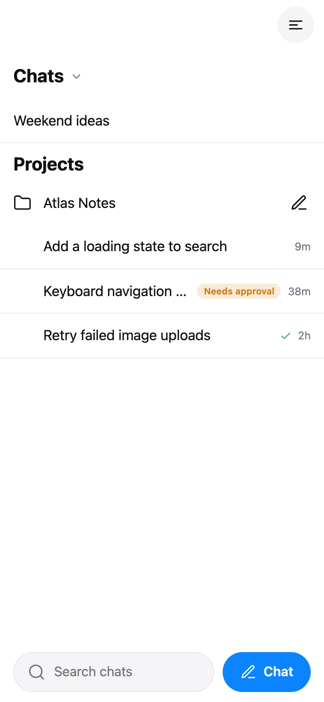 | 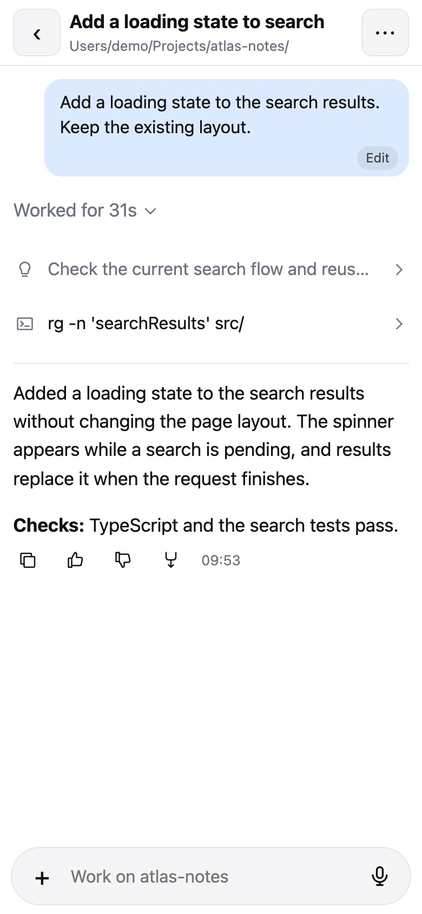 | 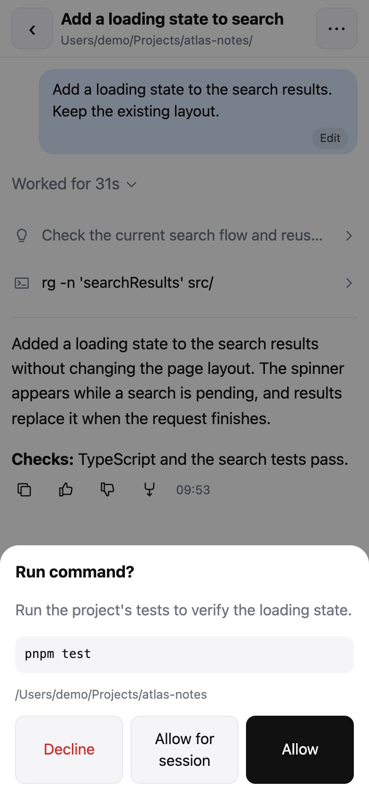 |

| 子代理入口 | 子代理列表 |
| :---: | :---: |
| 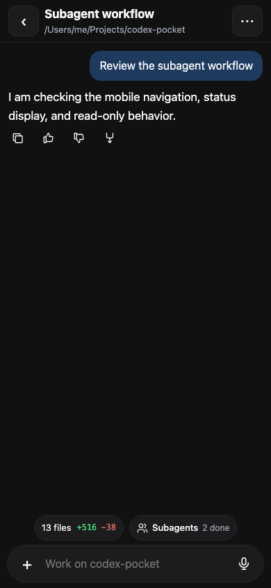 | 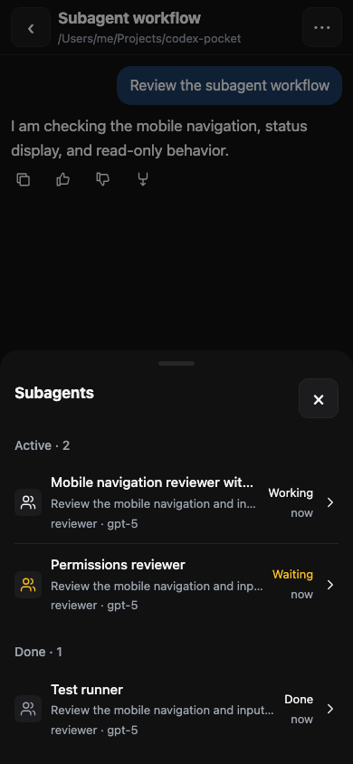 |

| 图片预览 |电脑设置 |
| :---: | :---: |
| 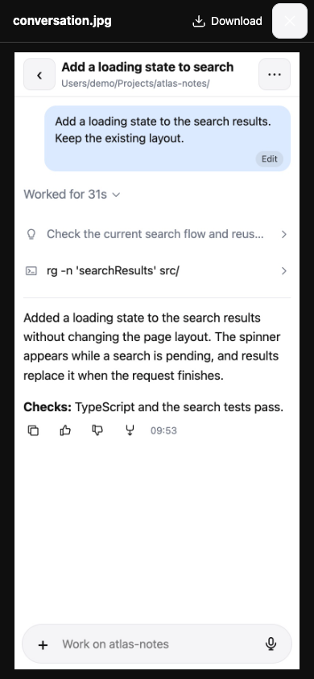 | 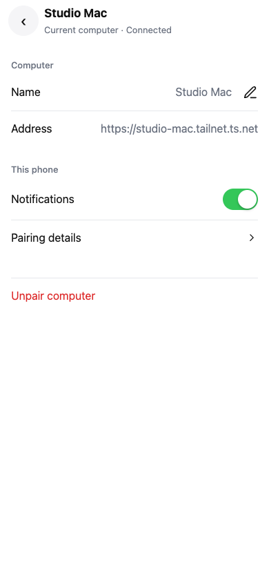 |

|电脑切换 | 新建会话 |
| :---: | :---: |
| 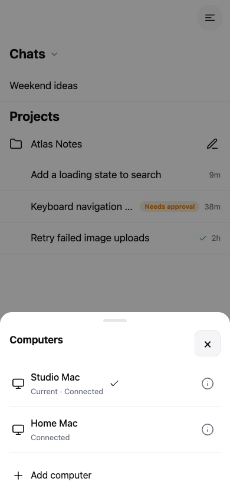 | 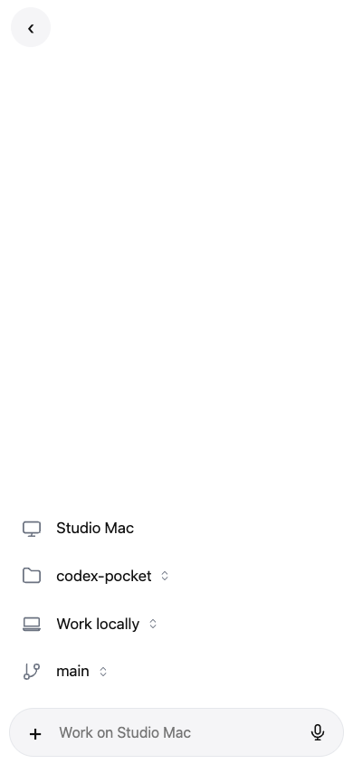 |

截图由真实界面组件和虚构的对话、路径及电脑信息生成，不含个人线程内容或配对凭据。

## 环境要求

- **Apple 芯片的 Mac，或 Linux x86_64 服务器**：DMG 面向 macOS arm64；Linux 使用独立的实验性 host 压缩包，见 [Linux 部署](./docs/linux.zh-CN.md)。
- **这台 Mac 上的 Codex 已登录**：安装 DMG 时先安装并登录 ChatGPT 桌面 app，Pocket 可使用它内置的 Codex CLI；源码构建也可使用单独安装的 `codex` CLI。host 沿用 Codex 的登录态，不自行登录。
- **Linux 需要 Node 22.12+ 和已安装、登录的 Codex CLI**（已测 0.161.0），运行压缩包不需要 pnpm。源码构建需要 Node 和 pnpm；Mac DMG 自带运行时。
- **一台能连到这台电脑的手机**：走 Tailscale 或局域网。iOS 需要把 PWA 添加到主屏幕，Safari 标签页里收不到 Web Push。

### 兼容性与当前限制

| 组件 | 当前范围 |
| :--- | :--- |
| Mac host | 正式版和本地应用构建面向 Apple 芯片（arm64）。当前应用分发范围不包含 Intel Mac 和 Windows host。 |
| Linux host（实验性） | 独立 x86_64 压缩包。已在 Debian 13 / Codex CLI 0.161.0 上用真实 iPhone PWA 验证聊天、推送与听写。ARM64、其他发行版和 systemd 开机恢复尚未验证。 |
| iPhone / Safari | 文档中的手机安装路径为 Safari 和主屏幕 PWA。通知需要 HTTPS，并添加到主屏幕。 |
| Android / 其他浏览器 | 界面使用浏览器 API，但仓库尚未记录这些组合的实机验证结果。请视为未验证，反馈时附上系统和浏览器版本。 |
| 桌面共享（macOS） | daemon 的 `account/read` 响应需要包含 `workspaceRouting`（Codex CLI 0.156.0 或更新版本）。关联操作会检查实际能力。 |
| 浏览器能力 | 基本聊天使用 WebSocket；通知和离线启动需要 HTTPS 及 service worker；听写还需要麦克风权限和浏览器音频 API。 |
| 自动检查 | CI 在 Linux 上执行类型检查、单元测试及 host/PWA 构建，不能据此认定 macOS 或手机兼容性。 |

仓库尚未发布完整的 macOS、iOS 和浏览器版本验证表。听写使用未文档化的 ChatGPT 接口，多台 Mac 同时向主屏幕 iPhone PWA 推送仍需实机验证。

## 快速开始

### 部署 Linux 服务器

从[最新版本](https://github.com/pocket-works/codex-pocket/releases/latest)下载 Linux x86_64 压缩包，按 [Linux 部署文档](./docs/linux.zh-CN.md)校验文件、配置 Node/Codex、Tailscale HTTPS、手机配对及可选的 systemd 用户服务。Linux 提供无界面 host；菜单栏应用和桌面关联仍是 macOS 功能。

### 安装 DMG

1. 在 Apple 芯片的 Mac 上安装并登录 ChatGPT 桌面 app。
2. 从[最新版本](https://github.com/pocket-works/codex-pocket/releases/latest)下载已签名并公证的 Apple 芯片 DMG，打开后把 **Codex Pocket** 拖入 **Applications（应用程序）**，再从应用程序中启动。应用图标会出现在菜单栏。
3. 选择连接方式：需要在外访问时，先按下文配置 [Tailscale HTTPS](#部署tailscale-https)，再配对手机；只需局域网基本聊天时，让手机与 Mac 连接同一网络即可。通知和听写需要 HTTPS。在 Pocket 菜单里选 **Pair a phone…**，用手机扫描二维码，或打开弹窗里的地址手动输入配对码。配对码 10 分钟后失效。
4. 在 Safari 中打开准备长期使用的 PWA 地址（需要通知时用 HTTPS 地址），选择**添加到主屏幕**。打开主屏幕 PWA 后，需要再次在 Pocket 菜单中配对，因为 iOS 为它使用独立的存储。需要 Web Push 时，打开 **Menu → Computers**，点击 Mac 旁的信息按钮进入详情，开启 **Notifications**。

要继续 ChatGPT 桌面 app 的线程，请按[桌面共享](#与桌面-codex-共享线程推荐)操作。先等待当前任务完成，再关联并退出、重新打开 ChatGPT。无需开启桌面共享也能使用 Pocket。

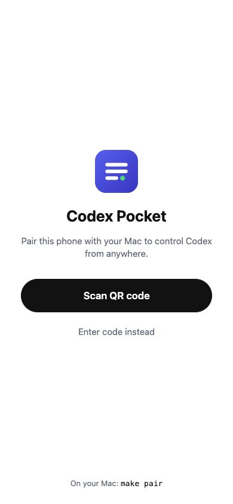

### 从源码构建

在 Apple 芯片的 Mac 上登录 Codex，并安装 Node 22.12+ 与 pnpm 后运行：

```bash
git clone https://github.com/pocket-works/codex-pocket.git
cd codex-pocket
pnpm install --frozen-lockfile
make app
make open-app
```

随后按上面的菜单步骤配对手机。`make app` 产出的是未签名的开发构建，正常安装请使用正式版 DMG。Codex 和浏览器要求见[兼容性与当前限制](#兼容性与当前限制)。

## 多台电脑

1. 在每台电脑上运行更新后的 Codex Pocket，并分别配置自己的 [Tailscale HTTPS](#部署tailscale-https) 地址。
2. 手机保留一个主屏幕 PWA，打开 **Menu → Computers**，选择 **Add computer**，在这个 PWA 内扫描另一台电脑的配对二维码。手动配对需要另一台电脑的 HTTPS 地址和配对码。
3. 在 **Computers** 中选择电脑即可切换。线程、项目、文件和任务属于各自的电脑。切换会保存草稿，不会停止正在运行的轮次；发送或上传过程中，要等待操作完成后才能切换。
4. 点击电脑旁的信息按钮，可以修改名称和地址、管理通知，或查看 **Pairing details**。需要恢复访问时，用新配对码执行 **Pair again**。
5. 要移除电脑，在该电脑可达时选择 **Unpair computer**，撤销手机权限并保留电脑上的聊天。**Remove locally** 只删除手机上的凭据，需要稍后在电脑上撤销旧配对。

主屏幕 PWA 保持原来的安装地址。应用资源缓存完成后，即使入口电脑暂时不可达，也能打开应用并连接其他电脑。首次安装、更新和注册新的通知 worker 仍需要入口地址可达。每台电脑使用独立作用域的 Web Push 订阅，点击通知会选择对应电脑和线程。多台电脑同时向主屏幕 iPhone PWA 推送，仍需实机验证。

升级会迁移当前 PWA 地址下已有的配对和本地数据。不同浏览器地址或主屏幕应用的存储无法自动导入，需要在保留的 PWA 中重新添加那些电脑。电脑地址变更需要重新配对，旧 token 不会发送到修改后的地址。

## 连接与数据流向

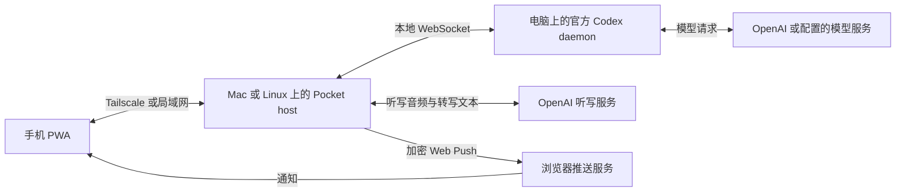

- **聊天和文件：** 指令与审批发送给 电脑上的 Codex，命令和文件操作也在那里执行；Codex 会把任务上下文发送给配置的模型服务。手机上传的文件保存在 Mac 的 `~/.codex-pocket/uploads/`。
- **登录和本地存储：** Codex 凭据留在 电脑上。手机在浏览器存储中保存自己的 Pocket 配对 token、草稿和偏好；host 保存 token 哈希和推送订阅。对话历史由 Codex 管理。
- **听写：** 麦克风音频经电脑 转发给 OpenAI，转写文本流式返回手机，Pocket 不在 host 上保存音频。
- **通知：** Mac 通过浏览器推送服务发送加密载荷。显示的通知可能包含对话标题或预览、命令审批片段或错误信息。即使聊天走局域网，推送通知仍需要互联网连接。

## 安全模型

host 是一个**透明代理**：手机配对后拿到的是 Codex app-server 的全部能力，包括在 电脑上执行命令和读写文件。安全边界只有两道——网络可达性和配对码——所以：

- 只通过 Tailscale（或局域网）访问，设置 `bindHost 127.0.0.1` 后端口不会暴露在局域网上；**不要**把它直接挂到公网（Cloudflare Tunnel、端口转发等）而不加额外认证。
- 配对码 8 位、10 分钟有效、猜错 5 次作废；设备 token 只存哈希，`revoke` 可随时吊销；管理接口只接受本机回环 + admin token。
- 浏览器配对绑定 PWA 来源地址。手机 API 的跨域访问同时校验对应配对的 token 和来源，管理接口不开放跨域访问；手机为每台电脑分别保存 token。
- 听写复用 `~/.codex/auth.json` 里的 ChatGPT 登录，通过未文档化的接口把音频发送给 OpenAI，Pocket 不在 host 上保存音频。存储和连接细节见[数据流向](#连接与数据流向)和[排障](#faq-与排障)。

## 运行：菜单栏应用

打开 **Codex Pocket** 会启动手机连接所需的 host，退出后手机访问停止。Codex 管理自己的 daemon。如果已关联桌面应用，独立转发服务会继续运行，直到选择 **Unlink desktop…**。

- **状态：** 灰色表示停止，黄色表示启动中或等待 Codex，绿色表示就绪，红色表示错误。菜单会显示访问地址和 daemon 连接状态。
- **配对：** **Pair a phone…** 显示二维码和配对码；打开已配对手机的子菜单可以撤销权限。
- **Keep this Mac awake：** host 运行时阻止闲置睡眠，并记住你的选择。屏幕仍可熄灭，电池供电时合盖仍会睡眠。
- **诊断：** 排障时可使用 **Restart host** 或 **Open log**。

## 部署：Tailscale HTTPS

使用 Tailscale HTTPS，可以通过同一个地址在家和在外访问，并使用通知和听写。`tailscale serve` 在 Pocket host 前提供 HTTPS，同一局域网中 Tailscale 可以直接连接。

1. Mac 和手机都安装 Tailscale 并登录同一账号；在 [管理控制台](https://login.tailscale.com/admin/dns) 打开 **HTTPS Certificates**（第一次跑 `tailscale serve` 时会给出启用链接）。
2. 在 Mac 上把 tailnet 名反代到 host：

   ```bash
   tailscale serve --bg --https=443 http://127.0.0.1:7333
   ```

   如果安装的是 DMG，在 `~/.codex-pocket/config.json` 中添加以下字段（保留原有字段），把示例 tailnet 名换成自己的，然后退出并重新打开 Pocket：

   ```json
   {
     "publicUrl": "https://<mac>.<tailnet>.ts.net",
     "bindHost": "127.0.0.1"
   }
   ```

   如果从源码构建，可运行下面的等效 CLI 命令，把示例 tailnet 名换成自己的；之后需要重启 host（使用 `make start` 启动的可运行 `make restart`）：

   ```bash
   pnpm dev:host config set publicUrl "https://<mac>.<tailnet>.ts.net"
   pnpm dev:host config set bindHost 127.0.0.1   # 只监听回环：局域网里其他设备碰不到 7333
   ```

3. 在 Pocket 菜单中选 **Pair a phone…**，二维码会指向 `https://<mac>.<tailnet>.ts.net/#pair=…`。手机连接 Tailscale 后扫码即可。源码构建的用户也可运行 `pnpm dev:host pair`。证书由 Tailscale 自动签发和续期。
4. 想要全屏体验就在 Safari 里“添加到主屏幕”。主屏幕 PWA 需要独立配对：再次选择 **Pair a phone…**，在 PWA 内扫码或输入 8 位配对码。
5. 打开 **Menu → Computers**，进入 Mac 的详情并开启 **Notifications**。轮次完成、Codex 请求审批或提问、轮次失败时会推送——除非 app 正开着那个线程。

源码构建可用 `pnpm dev:host config` 查看当前设置、`config unset <key>` 恢复默认；DMG 安装可编辑 `~/.codex-pocket/config.json`，重启 Pocket 后生效。

不想用 Tailscale 时，把自己的 PEM 放到 `~/.codex-pocket/certs/fullchain.pem` 和 `certs/privkey.pem`，host 会直接以 HTTPS 监听；`--no-tls` 强制明文。只在局域网使用也可以完全不配 HTTPS（不设 `bindHost`，默认监听所有接口），直接开 `http://<局域网 IP>:7333`，只是没有推送通知和离线启动等需要安全上下文的能力。

在 host 运行时打开 HTTPS PWA，等待应用资源完成缓存后，即使 Mac 上的 Pocket 已停止或无法连接，手机也能打开界面，显示连接提示，并在 host 恢复后自动重连。更新 Pocket 后，需要在 host 运行时打开一次手机应用，以刷新离线缓存。尚未缓存资源的首次访问仍需要 host 在线。

host 日志在 `~/.codex-pocket/host.log`，Codex daemon 日志在 `~/.codex/app-server-control/app-server.log`。

构建 PWA 后 `serve` 会自动从 `packages/web/dist` 提供页面：

```bash
pnpm --filter @codex-pocket/web build
pnpm dev:host serve
```

## 与桌面 Codex 共享线程（推荐）

桌面共享让手机和 ChatGPT 桌面 app 通过同一个 daemon 继续同一份 Codex 线程。如果桌面使用独立的 app-server，它占用的线程可能无法在手机上取得写入权。

1. 等当前轮次完成，在 Pocket 菜单中选择 **Desktop sharing → Link desktop…**。
2. 关联操作会检查 daemon 兼容性。如果缺少桌面工具环境，会重启 daemon 一次，中断正在进行的轮次。
3. 退出并重新打开 ChatGPT，再从手机打开桌面线程。

要恢复 ChatGPT 自己的 app-server，选择 **Desktop sharing → Unlink desktop…**，然后退出并重新打开 ChatGPT。仅退出 Pocket 不会停止独立的桌面转发服务。

源码用户可在仓库目录中运行：

```bash
pnpm dev:host desktop        # 检查关联状态和 daemon 兼容性
pnpm dev:host link-desktop   # 关联后退出并重新打开 ChatGPT
pnpm dev:host unlink-desktop # 解除关联后退出并重新打开 ChatGPT
```

从曾自带 `com.codex-pocket.shared-app-server` LaunchAgent 的旧版升级时，关联操作会先移除旧 agent，再安装转发服务。从 host 托管转发入口的版本升级时，重启 Pocket 并重新关联桌面，然后再退出 Pocket。两种迁移都应先等待桌面当前任务完成。

[架构与代码导览](./docs/architecture.md#daemon-connection-and-desktop-sharing)说明了转发服务、daemon 环境、桌面工具和自定义端口配置。

## 升级与卸载

Linux 的升级、回退与卸载见 [Linux 部署文档](./docs/linux.zh-CN.md#升级回退与卸载)，以下步骤适用于 Mac 应用。

### 升级

1. 等当前任务完成，退出 Codex Pocket，从[最新版本](https://github.com/pocket-works/codex-pocket/releases/latest)下载应用并替换 Applications 中的旧版。源码用户可更新工作区，运行 `pnpm install --frozen-lockfile`，再用 `make app` 重新构建并打开应用。
2. 启动 Pocket，保持 PWA 原安装地址对应的 Mac 可达。打开手机 PWA，出现 **Codex Pocket was updated — tap to reload** 时点击更新，或关闭后重新打开以加载新界面。多 Mac 场景中，切换电脑不会更新由原安装 Mac 提供的 PWA 资源。
3. 在手机 **Menu → About** 中检查版本。同一浏览器来源地址下，配对和本地数据会迁移；地址变更或清除浏览器存储后，需要重新配对。

各版本的特别说明见 [CHANGELOG.md](./CHANGELOG.md)。从旧的桌面共享方案升级时，请参考[与桌面 Codex 共享线程](#与桌面-codex-共享线程推荐)中的迁移说明。

### 卸载

1. 在 Pocket 运行时，从 Mac 的 **paired phones → 设备 → Revoke** 菜单撤销各手机的权限，或在已连接手机上选择 **Unpair computer**。
2. 如果已关联桌面应用，先选择 **Desktop sharing → Unlink desktop…**，再退出并重新打开 ChatGPT。删除 Pocket 前需要完成这一步：独立转发服务在 Pocket 退出后仍会运行。
3. 退出 Pocket，从 Applications 删除 **Codex Pocket.app**，移除手机主屏幕 PWA；如果配置过 Pocket 的 Tailscale Serve 映射，也可移除该映射。
4. Pocket 的本地配置、日志和上传文件仍保存在 `~/.codex-pocket/`。解除桌面关联后，如果不再需要这些数据，可以删除该目录；对话中引用的上传文件将无法再访问。Codex 的登录和历史由它自己管理，位于独立的 `~/.codex/` 中。

## FAQ 与排障

### Mac 必须一直开着吗？

是的。向某台 Mac 发送消息或访问文件时，Pocket 和 Codex daemon 需要运行，Mac 需要保持唤醒并可达。**Keep this Mac awake** 会在 Pocket 运行期间阻止闲置睡眠，但电池供电时合盖仍会睡眠。缓存后的手机界面可以离线打开，发送消息和读取实时结果则需要连接到 Mac。

| 问题 | 检查方法 |
| :--- | :--- |
| 手机连不上 | 检查菜单栏 host 状态及 **Codex daemon: connected**。局域网下使用 Mac 当前地址；Tailscale 下确认两端连接到同一 tailnet。配置 `bindHost: 127.0.0.1` 时，需要使用已配置的 Tailscale HTTPS 地址。需要恢复访问时，用新配对码执行 **Pair again**。 |
| 收不到通知 | 使用 HTTPS，在 iPhone 上添加到主屏幕，并在该电脑详情中开启 **Notifications**。检查系统通知权限及 Mac 到推送服务的网络。手机界面正显示同一线程时不会推送。多 Mac 同时向 iPhone 推送仍未完成实机验证。 |
| 无法继续桌面线程 | 开启 **Desktop sharing → Link desktop…**，退出并重新打开 ChatGPT。如果提示 daemon 不兼容，更新 Codex 后再检查。独立的桌面 app-server 可能占用线程写入锁，详见[桌面共享](#与桌面-codex-共享线程推荐)。 |
| 听写失败或不可用 | 使用 HTTPS 并授予麦克风权限。如果 Mac 需要代理，在 `~/.codex-pocket/config.json` 中把 `outboundProxy` 设为 HTTP 代理地址（如 `http://127.0.0.1:1082`），再重启 host。听写不读取 `HTTPS_PROXY`，该设置与 Codex 的模型连接配置相互独立。未文档化的听写接口也可能已发生变化。 |
| 升级后仍是旧界面 | 保持 PWA 原地址对应的 Mac 在线，点击更新提示，或关闭后重新打开 PWA。在 **Menu → About** 中与安装版本对照。清除站点数据会丢失本地配对和草稿；若采用此恢复方法，先复制草稿，并准备重新配对。 |

可从 Mac 菜单的 **Open log** 查看诊断信息。host 日志位于 `~/.codex-pocket/host.log`，桌面共享日志位于 `~/.codex-pocket/desktop-bridge.log`。[报告问题](https://github.com/pocket-works/codex-pocket/issues/new?template=bug_report.md)时，请附上 Pocket 和 Codex 版本、Mac/手机系统与浏览器版本、连接方式及复现步骤；分享日志前移除凭据、配对码和私人对话内容。

## 开发

```bash
pnpm install --frozen-lockfile
pnpm test
pnpm --filter @codex-pocket/web build # 启动服务前构建手机界面
pnpm dev:host info      # 连接信息
pnpm dev:host threads   # 桌面 Codex 的最近线程
pnpm dev:host serve     # 局域网服务，首次启动打印配对二维码
pnpm dev:host pair      # 再配一台手机
pnpm dev:host devices   # 已配对设备
pnpm dev:host revoke DEVICE_ID # 替换为 devices 列出的设备 ID
```

常用操作都包在 `Makefile` 里（`make app`、`make start`、`make pair`、`make status`…），`make help` 查看列表。`pnpm --filter @codex-pocket/desktop dev` 从工作区直接跑菜单栏应用（会先把 host 从源码打包）；改了 host 代码后重新跑一次，或者 `pnpm --filter @codex-pocket/desktop bundle` 之后在菜单里点 **Restart host**。

完整的 `pnpm build` 和菜单栏应用构建需要 macOS 工具。Linux 贡献者可以运行类型检查、单元测试，以及单独的 host/PWA 构建，详见[开发环境配置](./CONTRIBUTING.md#development-setup)和[本地开发流程](./CONTRIBUTING.md#local-development-loop)。

参与贡献请先看 [CONTRIBUTING.md](./CONTRIBUTING.md)；[架构与代码导览](./docs/architecture.md)介绍各包职责和桌面共享实现，代码约定见 [AGENTS.md](./AGENTS.md)。
维护者的 macOS 手动打包与发版检查见 [docs/releasing.md](./docs/releasing.md)。

状态目录 `~/.codex-pocket/`（`CODEX_POCKET_HOME` 可覆盖）：`devices.json`（token 哈希和推送订阅）、`admin.token`、`vapid.json`（Web Push 密钥对）、`runtime.json`、`config.json`、`certs/`、`uploads/`（手机发来的图片和 CSV 附件，每次上传最大 10 MB）、`host.log`；关联桌面后还有 `desktop-bridge.log`。

## 版本发布

带版本号的 macOS 应用和实验性 Linux x86_64 host 可从 [GitHub Releases](https://github.com/pocket-works/codex-pocket/releases) 下载。所有工作区包共用同一个语义化版本号，变更记录见 [CHANGELOG.md](./CHANGELOG.md)。维护者操作见[发版流程](./docs/releasing.md)。

## 帮助与反馈

- [报告问题](https://github.com/pocket-works/codex-pocket/issues/new?template=bug_report.md)或[提出需求](https://github.com/pocket-works/codex-pocket/issues/new?template=feature_request.md)，提交前先搜索[已有 Issue](https://github.com/pocket-works/codex-pocket/issues)。
- 安全问题请按 [SECURITY.md](./SECURITY.md) 私下报告。
- 欢迎修正文档和提交范围明确的 PR，参与方式见 [CONTRIBUTING.md](./CONTRIBUTING.md)。

这是个人业余项目，评审和发版可能需要一些时间。尚未验证的 Android 和浏览器组合，也欢迎反馈兼容性结果。

## 支持项目

如果 Codex Pocket 对你有帮助，欢迎[通过 GitHub Sponsors 支持项目开发](https://github.com/sponsors/jerryan999)。你可以自定义金额，选择按月赞助或一次性打赏。赞助完全自愿。手机端也可从 **Menu → About → Support the author** 打开赞助页面。

## 许可

MIT。`packages/protocol/src/generated` 由 OpenAI Codex CLI（Apache-2.0）的 `codex app-server generate-ts` 生成，原样收录，见 [packages/protocol/NOTICE](./packages/protocol/NOTICE)。
